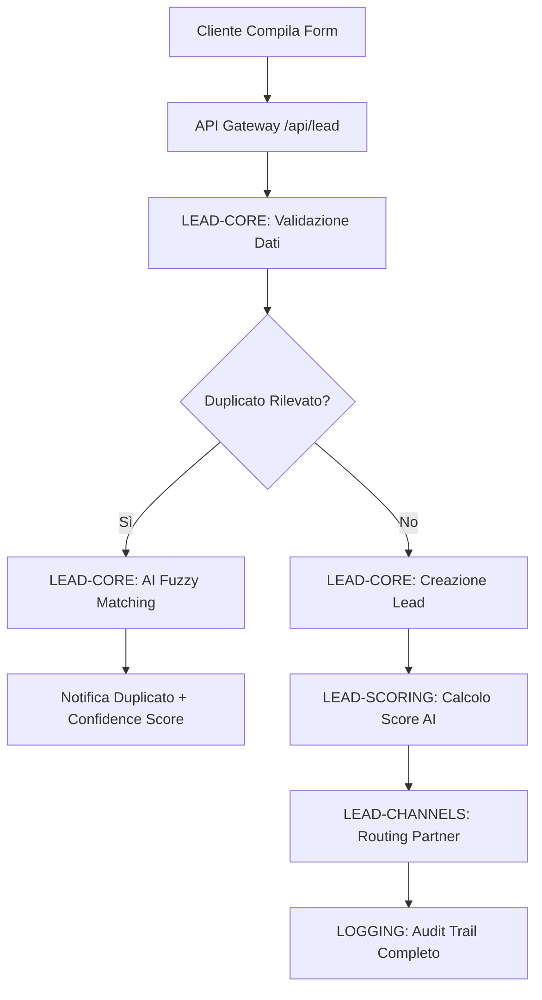
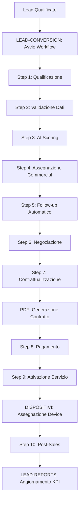
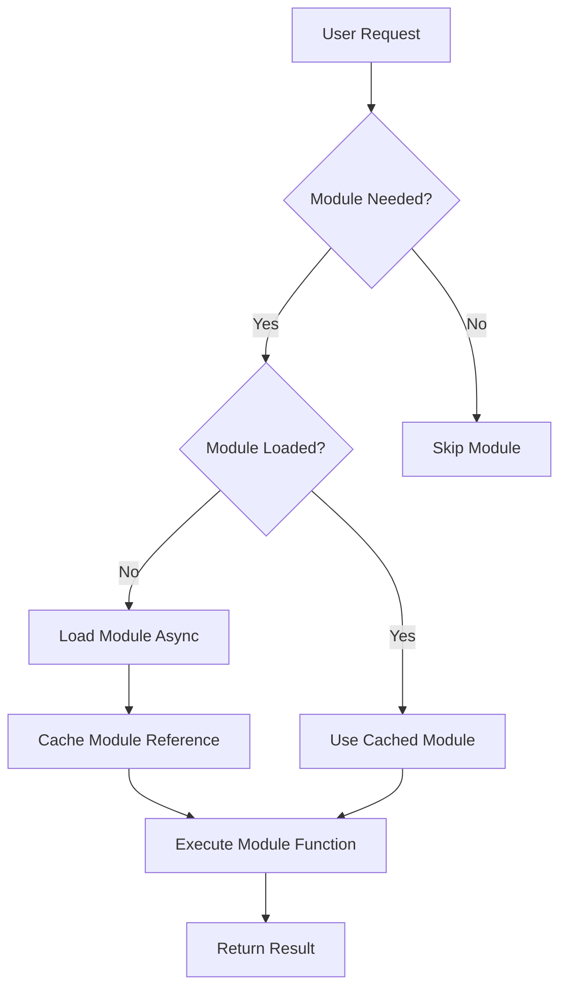

# TeleMedCare V11.0 Modular - Diagramma di Flusso Moduli

## Panoramica Architettura Modulare

```
┌─────────────────────────────────────────────────────────────────────────────────┐
│                        TeleMedCare V11.0 Modular Enterprise                     │
│                              Frontend Layer                                     │
└─────────────────────────────────────────────────────────────────────────────────┘
                                        │
                                        ▼
┌─────────────────────────────────────────────────────────────────────────────────┐
│                                 API Gateway                                     │
│                            (Hono Framework)                                     │
└─────────────────────────────────────────────────────────────────────────────────┘
                                        │
          ┌─────────────────────────────────────────────────────────┐
          │                                                         │
          ▼                                                         ▼
┌─────────────────────┐                                   ┌─────────────────────┐
│   LEAD-CONFIG       │◄──────────────────────────────────┤      LOGGING        │
│   📋 Configurazioni │                                   │   📝 Audit Trail    │
└─────────────────────┘                                   └─────────────────────┘
          │                                                         ▲
          │                                                         │
          ▼                                                         │
┌─────────────────────┐     ┌─────────────────────┐                 │
│    LEAD-CORE        │◄────┤   LEAD-CHANNELS     │─────────────────┘
│  🎯 Gestione Lead   │     │  🔗 Multi-Partner   │
└─────────────────────┘     └─────────────────────┘
          │                           │
          │                           │
          ▼                           ▼
┌─────────────────────┐     ┌─────────────────────┐
│  LEAD-SCORING       │     │  LEAD-CONVERSION    │
│  🧠 AI Predittivo   │────▶│  🔄 Workflow        │
└─────────────────────┘     └─────────────────────┘
          │                           │
          │                           │
          ▼                           ▼
┌─────────────────────┐     ┌─────────────────────┐
│  LEAD-REPORTS       │     │   DISPOSITIVI       │
│  📊 Business Intel  │     │  🔧 Inventory Mgmt  │
└─────────────────────┘     └─────────────────────┘
          │                           │
          │                           │
          ▼                           ▼
┌─────────────────────┐     ┌─────────────────────┐
│       UTILS         │     │        PDF          │
│  🛠️ Utilities      │     │  📄 Doc Generator   │
└─────────────────────┘     └─────────────────────┘
```

---

## Flusso di Elaborazione Lead

### 1. Acquisizione Lead



### 2. Workflow Conversione



---

## Interazioni tra Moduli

### Matrice di Dipendenze

| Modulo | CONF | CORE | CHAN | CONV | SCOR | REP | DISP | PDF | UTIL | LOG |
|--------|------|------|------|------|------|-----|------|-----|------|-----|
| **LEAD-CONFIG** | ● | → | → | → | → | → | ○ | ○ | → | ← |
| **LEAD-CORE** | ← | ● | → | → | → | → | ○ | ○ | → | ← |
| **LEAD-CHANNELS** | ← | ← | ● | → | ← | → | ○ | ○ | → | ← |
| **LEAD-CONVERSION** | ← | ← | ← | ● | → | → | → | → | → | ← |
| **LEAD-SCORING** | ← | → | → | ← | ● | → | ○ | ○ | → | ← |
| **LEAD-REPORTS** | ← | ← | ← | ← | ← | ● | ← | ○ | → | ← |
| **DISPOSITIVI** | ← | ○ | ○ | ← | ○ | → | ● | → | → | ← |
| **PDF** | ← | ○ | ○ | ← | ○ | → | ← | ● | → | ← |
| **UTILS** | ○ | ← | ← | ← | ← | ← | ← | ← | ● | ○ |
| **LOGGING** | → | → | → | → | → | → | → | → | ○ | ● |

**Legenda**: ● = Modulo stesso, → = Dipende da, ← = È utilizzato da, ○ = Nessuna interazione diretta

---

## Flussi Operativi Dettagliati

### A. Flusso Configurazione Sistema

```
ADMIN REQUEST
      │
      ▼
┌─────────────────────┐
│   LEAD-CONFIG       │ 1. Carica configurazione
│                     │ 2. Valida schema
│                     │ 3. Applica hot-reload
└─────────────────────┘
      │
      ▼
┌─────────────────────┐
│     LOGGING         │ 4. Audit configurazione
│                     │ 5. Backup precedente
└─────────────────────┘
      │
      ▼
┌─────────────────────┐
│   ALL MODULES       │ 6. Notifica aggiornamento
│                     │ 7. Refresh configurazioni
└─────────────────────┘
```

### B. Flusso Acquisizione Lead

```
FORM SUBMISSION
      │
      ▼
┌─────────────────────┐
│    LEAD-CORE        │ 1. Validazione input
│                     │ 2. Rilevamento duplicati (AI)
│                     │ 3. Creazione lead se valido
└─────────────────────┘
      │
      ▼
┌─────────────────────┐
│  LEAD-SCORING       │ 4. Calcolo score AI
│                     │ 5. Segmentazione (HOT/WARM/COLD)
│                     │ 6. Raccomandazioni automatiche
└─────────────────────┘
      │
      ▼
┌─────────────────────┐
│  LEAD-CHANNELS      │ 7. Routing partner appropriato
│                     │ 8. Invio notifiche
│                     │ 9. Webhook esterni
└─────────────────────┘
      │
      ▼
┌─────────────────────┐
│     LOGGING         │ 10. Audit trail completo
│                     │ 11. Security logging
│                     │ 12. Performance metrics
└─────────────────────┘
```

### C. Flusso Business Intelligence

```
SCHEDULER TRIGGER
      │
      ▼
┌─────────────────────┐
│  LEAD-REPORTS       │ 1. Query dati aggregati
│                     │ 2. Calcolo KPI real-time
│                     │ 3. Generazione dashboard
└─────────────────────┘
      │
      ▼
┌─────────────────────┐
│    LEAD-CORE        │ 4. Statistiche lead
│ + LEAD-SCORING      │ 5. Metriche scoring
│ + LEAD-CONVERSION   │ 6. Performance conversione
└─────────────────────┘
      │
      ▼
┌─────────────────────┐
│  LEAD-CHANNELS      │ 7. Performance partner
│ + DISPOSITIVI       │ 8. Metriche inventario
└─────────────────────┘
      │
      ▼
┌─────────────────────┐
│       PDF           │ 9. Export report (se richiesto)
│                     │ 10. Invio automatico stakeholder
└─────────────────────┘
```

### D. Flusso Gestione Dispositivi

```
DEVICE REGISTRATION
      │
      ▼
┌─────────────────────┐
│      UTILS          │ 1. Validazione IMEI
│                     │ 2. Parsing CE label
│                     │ 3. Verifica conformità
└─────────────────────┘
      │
      ▼
┌─────────────────────┐
│   DISPOSITIVI       │ 4. Registrazione inventario
│                     │ 5. Assegnazione cliente (se richiesto)
│                     │ 6. Tracking warranty
└─────────────────────┘
      │
      ▼
┌─────────────────────┐
│       PDF           │ 7. Generazione certificato
│                     │ 8. Manuale utente personalizzato
└─────────────────────┘
      │
      ▼
┌─────────────────────┐
│     LOGGING         │ 9. Audit registrazione
│                     │ 10. Compliance tracking
└─────────────────────┘
```

---

## Pattern di Comunicazione

### 1. Sincrono (Request-Response)
```typescript
// Esempio: Validazione lead con scoring immediato
const leadValidation = async (leadData: LeadInput) => {
  // 1. LEAD-CORE valida e crea
  const lead = await LeadCore.creaLead(leadData)
  
  // 2. LEAD-SCORING calcola score immediato
  const score = await LeadScoring.calcolaScoreCompleto(lead.id)
  
  // 3. LOGGING registra operazione
  await Logging.audit('LEAD_CREATED', { leadId: lead.id, score })
  
  return { lead, score }
}
```

### 2. Asincrono (Event-Driven)
```typescript
// Esempio: Workflow conversione multi-step
const conversionWorkflow = async (leadId: string) => {
  // 1. Avvio asincrono workflow
  const workflowId = await LeadConversion.avviaConversioneCompleta(leadId)
  
  // 2. Background processing steps
  await Promise.all([
    LeadScoring.aggiornaPredizioni(leadId),
    LeadChannels.notificaPartner(leadId),
    LeadReports.aggiornaDashboard()
  ])
  
  return { workflowId, status: 'STARTED' }
}
```

### 3. Caching Pattern
```typescript
// Esempio: Cache multi-livello
const getCachedLead = async (leadId: string) => {
  // L1: Memory cache (fastest)
  let lead = await Utils.CacheManager.get(`lead:${leadId}`)
  if (lead) return lead
  
  // L2: Database query
  lead = await LeadCore.ottieniLead(leadId)
  
  // Store in cache for next time
  await Utils.CacheManager.set(`lead:${leadId}`, lead, 300) // 5 min TTL
  
  return lead
}
```

---

## Gestione degli Errori

### Error Propagation Flow

```
MODULE ERROR
      │
      ▼
┌─────────────────────┐
│     LOGGING         │ 1. Log error dettagliato
│                     │ 2. Classify error type
│                     │ 3. Security analysis
└─────────────────────┘
      │
      ▼
┌─────────────────────┐
│   ERROR HANDLER     │ 4. Determine retry strategy
│                     │ 5. Fallback mechanism
│                     │ 6. User notification
└─────────────────────┘
      │
      ▼
┌─────────────────────┐
│  LEAD-REPORTS       │ 7. Error metrics update
│                     │ 8. Alert if threshold exceeded
│                     │ 9. Dashboard notification
└─────────────────────┘
```

### Circuit Breaker Pattern

```typescript
// Esempio: Protezione chiamate partner esterni
class PartnerCircuitBreaker {
  private failures = 0
  private lastFailure = 0
  private readonly threshold = 5
  private readonly timeout = 60000 // 1 minute
  
  async call(partnerOperation: () => Promise<any>) {
    if (this.isOpen()) {
      throw new Error('Circuit breaker OPEN')
    }
    
    try {
      const result = await partnerOperation()
      this.onSuccess()
      return result
    } catch (error) {
      this.onFailure()
      throw error
    }
  }
  
  private isOpen(): boolean {
    return this.failures >= this.threshold && 
           (Date.now() - this.lastFailure) < this.timeout
  }
}
```

---

## Performance Optimization

### Lazy Loading Strategy



### Caching Layers

```
┌─────────────────────────────────────────────────────────────────┐
│                        L1 Cache (Memory)                        │
│                     TTL: 1-5 min, Size: 100MB                  │
└─────────────────────────────────────────────────────────────────┘
                                  │
                                  ▼
┌─────────────────────────────────────────────────────────────────┐
│                      L2 Cache (Cloudflare KV)                  │
│                   TTL: 1-24 hours, Size: 10GB                  │
└─────────────────────────────────────────────────────────────────┘
                                  │
                                  ▼
┌─────────────────────────────────────────────────────────────────┐
│                    L3 Storage (Cloudflare D1)                  │
│                     Persistent, Size: Unlimited                 │
└─────────────────────────────────────────────────────────────────┘
```

---

## Security Flow

### Authentication & Authorization

```
CLIENT REQUEST
      │
      ▼
┌─────────────────────┐
│   API GATEWAY       │ 1. Extract JWT token
│                     │ 2. Validate signature
│                     │ 3. Check expiration
└─────────────────────┘
      │
      ▼
┌─────────────────────┐
│     LOGGING         │ 4. Log access attempt
│                     │ 5. Security analysis
│                     │ 6. Rate limit check
└─────────────────────┘
      │
      ▼
┌─────────────────────┐
│  TARGET MODULE      │ 7. Execute authorized operation
│                     │ 8. Apply data filters
│                     │ 9. Return filtered result
└─────────────────────┘
      │
      ▼
┌─────────────────────┐
│     LOGGING         │ 10. Audit operation
│                     │ 11. Performance metrics
│                     │ 12. Security events
└─────────────────────┘
```

### Data Encryption Flow

```typescript
// Esempio: Encryption pipeline per dati sensibili
const secureDataFlow = {
  // 1. Input validation
  validate: (data: any) => Utils.validateInput(data),
  
  // 2. Encrypt sensitive fields
  encrypt: (data: ValidatedData) => Utils.encrypt(data.sensitive),
  
  // 3. Store with audit
  store: async (encryptedData: string) => {
    await LeadCore.storeLead(encryptedData)
    await Logging.audit('DATA_STORED', { encrypted: true })
  },
  
  // 4. Decrypt for authorized access
  decrypt: async (leadId: string, userId: string) => {
    await Logging.audit('DATA_ACCESS', { leadId, userId })
    const encrypted = await LeadCore.getLead(leadId)
    return Utils.decrypt(encrypted.sensitiveData)
  }
}
```

---

## Monitoring & Observability

### Health Check Flow

```
SCHEDULER (every 30s)
      │
      ▼
┌─────────────────────┐
│   ALL MODULES       │ 1. Self health check
│                     │ 2. Dependency check
│                     │ 3. Performance metrics
└─────────────────────┘
      │
      ▼
┌─────────────────────┐
│  LEAD-REPORTS       │ 4. Aggregate health data
│                     │ 5. Calculate system score
│                     │ 6. Generate alerts if needed
└─────────────────────┘
      │
      ▼
┌─────────────────────┐
│     LOGGING         │ 7. Log health metrics
│                     │ 8. Store historical data
│                     │ 9. Trigger alerts
└─────────────────────┘
```

### Metrics Collection

```typescript
// Esempio: Metriche real-time per ogni modulo
const moduleMetrics = {
  leadCore: {
    operations: ['create', 'read', 'update', 'delete'],
    metrics: ['latency', 'throughput', 'errors', 'cache_hits']
  },
  
  leadScoring: {
    operations: ['calculate_score', 'batch_scoring'],
    metrics: ['accuracy', 'prediction_time', 'model_performance']
  },
  
  leadChannels: {
    operations: ['partner_sync', 'webhook_processing'],
    metrics: ['partner_latency', 'success_rate', 'retry_count']
  }
}
```

---

## Conclusioni

Il diagramma di flusso dei moduli TeleMedCare V11.0 Modular dimostra:

1. **🏗️ Architettura Pulita**: Separazione chiara delle responsabilità
2. **🔄 Flussi Ottimizzati**: Comunicazione efficiente tra moduli
3. **🛡️ Security by Design**: Sicurezza integrata in ogni flusso
4. **📊 Observability Completa**: Monitoring e logging pervasivi
5. **⚡ Performance Focus**: Cache multi-livello e lazy loading

Questa architettura modulare garantisce:
- **Scalabilità**: Ogni modulo può essere scalato indipendentemente
- **Maintainability**: Modifiche isolate senza impatti cross-module
- **Testability**: Unit test facili per ogni singolo modulo
- **Deployability**: Deploy independenti per rilasci graduali

---

*TeleMedCare V11.0 Modular - Sistema Enterprise per Lead Management Medicale*
*Medica GB S.r.l. - "La tecnologia che ti salva salute e vita"*